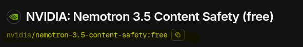

# ChatAIssistant
Twitch chat AI assistant, can answer questions for you


## Installation

Official releases providing Mac/Linux executable & Windows bat scripts with libraries
You can also build latest version from source code by yourself 

## HowTo

### Use it:

You need libs and bin folder with executables
go to [this](https://twitchtokengenerator.com/) website 
Choose Bot Chat Token and then authorize with Twitch 
Copy access token and client id

save client id to configs/clientId.txt
save access token to configs/accessToken.txt
save this (https://openrouter.ai/api/v1/chat/completions) to configs/apiProviderURL.txt

go to openrouter.ai - Get API Key - Sign in or Sign up
create new API key and save it to configs/apiKey.txt

go to Models and choose one comparing to your budget or choose one with (free)
copy and save model name to configs/model.txt


choose word that would trigger model and save to configs/askWord.txt 
write info about you to configs/bio.txt
write your rules for model to configs/rules.txt (if you dont want model to response on some themes make instruction to response with "none")
        

### Build it:

You need to install Gradle latest version, JDK 21

```
git clone https://github.com/IsThisALis/ChatAIssistant.git 
```

move to ChatAIssistant

```
gradle build 
```

get build/distributions/ChatAIssistant .zip or .rar

unpack and place configs folder to ChatAIssistant/bin
