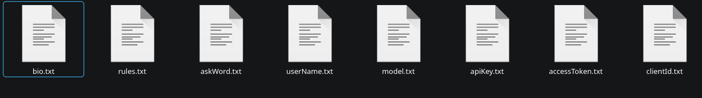

# ChatAIssistant
Twitch ИИ-ассистент, может отвечать на самые разные вопросы.
В следующих обновлениях планируется добавить средства модерации чата.

## Установка

- Скачайте последний релиз в удобном формате (`.zip` или `.tar`).
- Распакуйте в любом месте, где планируете хранить программу.
- Настройте (см. пункт **Настройка**) и запустите `.bat` (Windows) или `executable` (Linux и Mac).

*Также вы можете собрать проект из исходников, чтобы получать самые последние обновления.*

### Настройка

1. Перейдите на [сайт разработчиков Twitch](https://dev.twitch.tv/) (обязательно наличие 2FA на аккаунте).
2. Выберите **Chat Bot** и авторизуйтесь (сообщения будут отправляться с аккаунта, через который вы вошли).
3. Убедитесь, что права `chat:read` и `chat:edit` включены.
4. Заполните конфигурационные файлы:
   - Ваш никнейм в `configs/userName.txt` (например: `IsThisALis`)
   - Client ID в `configs/clientId.txt`
   - Access Token в `configs/accessToken.txt`
   - Ссылку `https://openrouter.ai/api/v1/chat/completions` в `configs/apiProviderURL.txt`

5. Перейдите на [openrouter.ai](https://openrouter.ai/) → **Get API Key** → войдите или зарегистрируйтесь.
   - Создайте новый API-ключ и сохраните его в `configs/apiKey.txt`.

6. Перейдите в раздел **Models** и выберите подходящую по бюджету (или любую с пометкой `(free)`).
   - Скопируйте название модели и сохраните его в `configs/model.txt`.

Вот так выглядит "имя модели":


7. Настройте логику бота:
   - Выберите слово-триггер для вызова модели и сохраните в `configs/askWord.txt`.
   - Напишите информацию о себе в `configs/bio.txt`.
   - Пропишите правила для модели в `configs/rules.txt` *(если не хотите, чтобы модель отвечала на определенные темы, добавьте инструкцию отвечать словом `"none"`)*.

Вот так должна выглядеть ваша папка `configs`:


### Компиляция из исходников

Вам понадобятся последняя версия Gradle и JDK 21.

```bash
git clone https://github.com/IsThisALis/ChatAIssistant.git 
cd ChatAIssistant
gradle build 
```

- Заберите собранный архив (`.zip` или `.tar`) из папки `build/distributions/`.
- Распакуйте его и переместите папку `configs` внутрь `ChatAIssistant/bin`.

# FAQ

Пока пусто. Если возникнут проблемы — создайте Issue.
